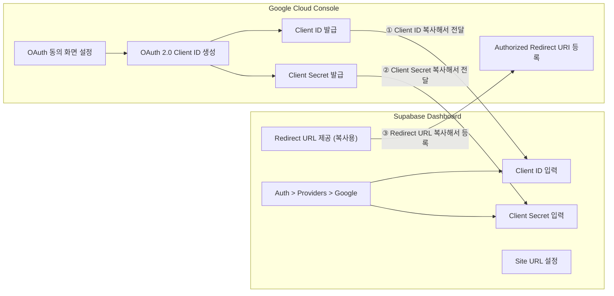
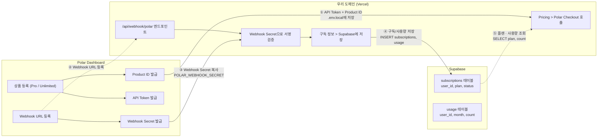

![[Pasted image 20260418165003.png|697]]

<aside> 🚀

**이 문서는 유튜브 영상을 보고 혼자 따라하실 수 있도록 만든 상세 가이드입니다.**

모든 단계를 디테일한 설명, 링크, AI 프롬프트와 함께 정리했습니다.

</aside>

---

## 영상 개요

|항목|내용|
|---|---|
|**핵심 메시지**|"벽은 생각보다 낮다" — 시작, 인증, 결제 3가지 벽만 넘으면 누구나 서비스 런칭 가능|
|**만들 서비스**|Gemini 래퍼 SaaS (AI 채팅 + 로그인 + 결제 + 배포)|
|**예상 소요 시간**|약 60분|

---

## 타임스탬프

|파트|내용|
|---|---|
|WALL 1|시작 (Antigravity + Next.js + GitHub)|
|WALL 2|인증 (Supabase + Google Login)|
|핵심 기능|Gemini 래퍼 + UI + 대화 저장|
|WALL 3|결제 (Polar + Checkout + 배포 + Customer Portal + 테스트)|
|구독 설계|3-tier 플랜 라이프사이클 구현|
|테스트|구독 플로우 + UI 검증|
|암호화|AES-256-GCM 유저 정보 보호|

---

## 사용 기술 스택 + 링크

|역할|기술|링크|
|---|---|---|
|IDE|Antigravity (Gemini Agent 내장)|[antigravity.google](http://antigravity.google)|
|프레임워크|Next.js + TypeScript + Tailwind CSS|[nextjs.org](http://nextjs.org)|
|인증 + DB|Supabase|[supabase.com](http://supabase.com)|
|AI|Gemini API (2.0 Flash)|[aistudio.google.com](http://aistudio.google.com)|
|결제|Polar|[polar.sh](http://polar.sh)|
|배포|Vercel|[vercel.com](http://vercel.com)|
|버전 관리|GitHub|[github.com](http://github.com)|
|UI 레퍼런스|[21st.dev](http://21st.dev)|[21st.dev](http://21st.dev)|
|Node.js (필수)|Node.js LTS|[nodejs.org](http://nodejs.org)|

---

# 🧱 WALL 1: 시작 [2:00 ~ 8:00]

<aside> 💡

딱 3가지만 깔면 됩니다: **Antigravity + Next.js + GitHub**

</aside>

---

## 1-1. Antigravity 설치 + 셋업

<aside> 📌

**Antigravity** = 구글이 만든 AI 코딩 에디터. VS Code 기반 + Gemini 에이전트 내장. 현재 **무료**.

</aside>

1. [antigravity.google/download](http://antigravity.google/download) 에서 본인 OS에 맞는 버전 다운로드
2. 설치 후 첫 실행 → 셋업 화면
3. **에이전트 정책 선택**: **"Review-driven development"** 선택 (AI가 코드 짜면 우리가 확인·승인)
4. 구글 계정 로그인
5. 왼쪽 Agent Manager 패널 확인 → 여기서 에이전트에게 채팅으로 작업 지시

---

## 1-2. Next.js 프로젝트 생성

<aside> 📌

**Next.js** = 웹사이트 만드는 도구. 요즘 웬만한 웹 서비스가 이걸로 만들어짐.

</aside>

Antigravity 터미널에서 아래 명령어 실행:

```bash
npx create-next-app@latest my-gemini-wrapper
```

- 옵션 설정
    - TypeScript → **Yes**
    - Tailwind CSS → **Yes**
    - App Router → **Yes**
    - 나머지 → 기본값 (Enter)

에이전트에게 보일러플레이트 정리 요청:

<aside> 🤖

**AI 프롬프트:** "보일러플레이트 정리해줘. 불필요한 기본 스타일이랑 예시 코드 지워줘."

</aside>

<aside> ⚠️

**에러 대응:** `npx`가 안 된다고 뜨면 → Node.js가 없는 것. [nodejs.org](http://nodejs.org)에서 LTS 버전 다운로드 후 터미널 재시작.

</aside>

---

## 1-3. GitHub 연동

<aside> 📌

바이브 코딩에서 Git = **세이브 포인트**. AI가 코드를 망치면 되돌려야 하니까 반드시 해주세요.

</aside>

1. [github.com](http://github.com)에서 새 레포지토리 생성
2. 터미널에서 실행:

```bash
git remote add origin [본인 레포 URL]
git branch -M main
git push -u origin main
```

---

## 1-4. 랜딩 페이지 기본 구조

1. [21st.dev](http://21st.dev)에서 맘에 드는 랜딩 페이지 레퍼런스 찾기
2. 에이전트에게 요청:

<aside> 🤖

**AI 프롬프트:** "이 레퍼런스를 참고해서 히어로 섹션을 만들어줘. Gemini 래퍼 서비스야. 다크 테마로 해주고, 심플하게."

</aside>

1. 히어로 + 기본 구조만 잡고 넘어가기 (나중에 다듬을 예정)
2. 커밋:

```bash
git add . && git commit -m "feat: landing page hero section" && git push
```

<aside> 💡

**바이브 코딩 팁:** 처음부터 완벽하게 하려고 하면 끝이 없습니다. 일단 돌아가게 만들고, 나중에 예쁘게!

</aside>

---

### ✅ WALL 1 체크리스트

- [ ] Antigravity 설치 + 셋업
- [ ] Next.js 프로젝트 생성
- [ ] GitHub 레포 연동
- [ ] 랜딩 페이지 히어로 섹션 만들기

---

# 🧱 WALL 2: 인증 [8:00 ~ 18:00]

<aside> 💡

**Supabase + Google Login**으로 해결. 콘솔 설정 빼면 코드는 에이전트가 3분 만에 짬.

</aside>

## Supabase + Google OAuth 연동 흐름

서로 주고받는 키와 URL 관계



<aside> 🗺️

**흐름 요약:** 1️⃣ Google Console에서 Client ID/Secret 생성 → 2️⃣ Supabase Provider에 ID/Secret 붙여넣기 → 3️⃣ Supabase Redirect URL을 Google에 등록 → ✅ OAuth 로그인 연동 완료!

</aside>

---

## 2-1. Supabase 프로젝트 생성

<aside> 📌

**Supabase** = 백엔드 통째로 제공 (인증 + DB + 스토리지). 무료 플랜 있음. 인증 붙이면서 DB도 같이 세팅됨.

</aside>

1. [supabase.com](http://supabase.com) 가입 (GitHub 계정 가능)
2. "New Project" → 프로젝트 이름 입력 → 리전 선택
3. 프로젝트 Settings에서 **URL**과 **anon key (publishable key)** 복사해두기

---

## 2-2. Google Cloud Console OAuth 설정

<aside> 📌

"우리 앱에서 구글 로그인을 쓸 거야"라고 구글한테 허락받는 과정.

</aside>

1. [Google Cloud Console](https://console.cloud.google.com) 접속
2. 새 프로젝트 생성
3. 왼쪽 메뉴: **API 및 서비스** → **사용자 인증 정보**
4. **"+ 사용자 인증 정보 만들기"** → **"OAuth 클라이언트 ID"**
5. 애플리케이션 유형: **"웹 애플리케이션"**
6. 승인된 리디렉션 URI에 Supabase 콜백 URL 입력:

`https://[프로젝트ID].[supabase.co/auth/v1/callback](<http://supabase.co/auth/v1/callback>)`

1. **클라이언트 ID**와 **클라이언트 시크릿** 복사

<aside> ⚠️

**에러 대응:** "동의 화면을 구성해야 합니다" 메시지 → OAuth 동의 화면 설정에서 앱 이름 + 이메일만 입력. **테스트 모드**로 시작하고 나중에 프로덕션으로 변경.

</aside>

---

## 2-3. Supabase에 Google Provider 연결

1. Supabase 대시보드 → **Authentication** → **Providers**
2. **Google** 찾아서 활성화 (Enable)
3. 아까 복사한 **클라이언트 ID**와 **시크릿** 붙여넣기
4. 저장

---

## 2-4. 코드 작업 - 에이전트에게 로그인 구현 시키기

- 환경변수 설정
    
    프로젝트 루트에 `.env.local` 파일 생성:
    
    ```
    NEXT_PUBLIC_SUPABASE_URL=https://[프로젝트ID].supabase.co
    NEXT_PUBLIC_SUPABASE_ANON_KEY=[anon key]
    ```
    
- 에이전트에게 구현 요청
    
    <aside> 🤖
    
    **AI 프롬프트:** "Supabase Google OAuth 로그인을 구현해줘. 다음 요구사항이야:
    
    1. 로그인 페이지에 구글 로그인 버튼
    2. AuthContext로 전역 로그인 상태 관리
    3. 미로그인 시 대시보드 접근 차단 (리다이렉트)
    4. 로그아웃 기능 Supabase URL이랑 anon key는 .env.local에 넣어둘게."
    
    </aside>
    
- 에이전트가 만들어주는 것들
    
    - **로그인 페이지** — 구글 로그인 버튼
    - **AuthContext** — 앱 전체에서 로그인 상태 확인
    - **미들웨어** — 비로그인 사용자 리다이렉트
    - **로그아웃** — 로그아웃 기능

<aside> ⚠️

**에러 대응:**

- "Invalid API key" → `.env.local`에 키를 잘못 넣었거나 앞뒤 공백이 있는 경우
- "redirect_uri_mismatch" → Google Cloud Console URI와 Supabase 설정이 다른 경우
- **에러 메시지를 그대로 에이전트한테 붙여넣으세요.** 대부분 알아서 해결해 줍니다.

</aside>

---

## 2-5. 로그인 테스트

1. `npm run dev`로 로컬 서버 실행
2. 로그인 페이지 → "구글로 로그인" 클릭
3. 구글 계정 선택 → 대시보드 진입 확인
4. 로그아웃 → 랜딩 페이지로 돌아가는지 확인
5. 로그아웃 상태에서 대시보드 URL 직접 입력 → 로그인 페이지로 리다이렉트 확인
6. 커밋:

```bash
git add . && git commit -m "feat: google auth with supabase" && git push
```

---

## 2-6. Supabase MCP 연결 (선택사항, 강력 추천)

<aside> 📌

**MCP (Model Context Protocol)** = AI 에이전트가 Supabase에 직접 접근할 수 있게 해주는 연결 규격. 연결하면 에이전트가 DB 테이블 조회, SQL 실행, 로그 확인, TypeScript 타입 생성 등을 **자연어 명령**으로 해줌.

</aside>

<aside> 💡

**왜 쓰나요?** MCP 없이는 에이전트한테 DB 구조를 일일이 설명해야 하지만, MCP를 연결하면 에이전트가 알아서 DB를 보고 코드를 짜줍니다. 특히 RLS 정책, 마이그레이션, 테이블 생성 작업이 훨씬 빨라짐.

</aside>

- Supabase MCP가 제공하는 기능
    
    |기능 그룹|설명|
    |---|---|
    |**Database**|테이블 목록 조회, SQL 쿼리 실행, 마이그레이션 관리|
    |**Debugging**|서비스 로그 확인, 보안/성능 어드바이저|
    |**Development**|프로젝트 URL, API 키 조회, TypeScript 타입 자동 생성|
    |**Edge Functions**|엣지 펑션 목록 조회, 배포|
    |**Docs**|Supabase 공식 문서 검색|
    
- 설정 방법 (Antigravity / Cursor 기준)
    
    1. 프로젝트 루트에 `.cursor/mcp.json` 파일 생성 (Antigravity도 동일 경로):
    
    ```json
    {
      "mcpServers": {
        "supabase": {
          "url": "<https://mcp.supabase.com/mcp>"
        }
      }
    }
    ```
    
    2. 에디터 재시작 → MCP 클라이언트가 브라우저 로그인을 요청
    3. Supabase 계정으로 로그인하면 연결 완료
    4. 에이전트에게 "내 Supabase 테이블 목록 보여줘" 같은 자연어로 테스트
- 추천 설정 옵션
    
    URL 파라미터로 기능을 제한할 수 있습니다:
    
    ```
    <https://mcp.supabase.com/mcp?read_only=true&project_ref=[프로젝트ID]>
    ```
    
    - `read_only=true` — 읽기 전용 (실수로 데이터 변경 방지)
    - `project_ref=[ID]` — 특정 프로젝트만 접근 가능하게 제한

<aside> ⚠️

**보안 주의사항:**

- **프로덕션 DB에는 직접 연결하지 마세요** — 개발/테스트 환경에서만 사용
- 처음에는 `read_only=true`로 시작하는 것을 추천
- MCP 클라이언트의 **수동 도구 승인(manual tool approval)** 설정을 켜두세요

</aside>

<aside> 💡

**자세한 설정 가이드:** [supabase.com/docs/guides/getting-started/mcp](http://supabase.com/docs/guides/getting-started/mcp)

</aside>

---

### ✅ WALL 2 체크리스트

- [ ] Supabase 프로젝트 생성
- [ ] Google Cloud Console에서 OAuth 클라이언트 설정
- [ ] Supabase Auth에 Google Provider 연결
- [ ] 로그인/로그아웃 UI 구현
- [ ] 로그인 테스트 (Google 계정으로 확인)
- [ ] (선택) Supabase MCP 연결

---

# ⚡ 핵심 기능: Gemini 래퍼 [18:00 ~ 32:00]

<aside> ⚡

서비스의 심장을 만드는 단계. **대시보드 UI + Gemini API 연동 + 대화 저장**

</aside>

---

## 3-1. 대시보드 UI 만들기

<aside> 🤖

**AI 프롬프트:** "로그인한 사용자를 위한 대시보드를 만들어줘.

- 왼쪽: 대화 히스토리 사이드바 (대화 목록, 새 대화 버튼)
- 오른쪽: 채팅 인터페이스 (메시지 표시, 입력창)
- 상단: 사용자 정보, 남은 크레딧 표시
- 다크 테마, 미니멀하게."

</aside>

<aside> 💡

**수정 필요하면 말로 하세요.** 예: "사이드바 폭 좀 줄여주고, 채팅 입력창을 좀 더 크게 만들어줘." 코드를 읽을 필요 없이 원하는 걸 말로 설명하면 AI가 수정해줍니다.

</aside>

<aside> ⚠️

**에러 대응:** UI를 여러 번 수정하다 레이아웃이 깨지면 → "마지막 변경 되돌려줘"라고 하거나, 심하면 `git`으로 되돌리세요.

</aside>

---

## 3-2. Gemini API 연동

- API 키 발급
    
    <aside> 📌
    
    **Gemini API** = 구글의 AI 모델을 우리 앱에서 쓸 수 있게 해주는 열쇠. 무료로 발급 가능하고, Gemini 2.0 Flash 모델은 무료 티어가 넉넉해서 테스트 비용이 거의 없습니다.
    
    </aside>
    
    1. [Google AI Studio](%7B%7B%3Chttps://aistudio.google.com%3E%7D%7D) 접속
    2. 구글 계정으로 로그인
    3. 왼쪽 사이드바에서 **"Get API key"** 클릭
    4. **"Create API key"** 버튼 클릭
    5. Google Cloud 프로젝트 선택 (없으면 자동 생성됨)
    6. 생성된 API 키 복사 (`AIza...`로 시작)
    7. `.env.local`에 추가:
    
    ```jsx
    GEMINI_API_KEY=AIza...
    ```
    
    <aside> ⚠️
    
    **주의:** `NEXT_PUBLIC_` 접두사를 붙이지 마세요! API 키가 클라이언트에 노출되면 누구나 쓸 수 있게 됩니다. 서버 사이드에서만 사용해야 합니다.
    
    </aside>
    
- 에이전트에게 구현 요청
    
    <aside> 🤖
    
    **AI 프롬프트:** "Gemini API를 사용해서 채팅 기능을 구현해줘.
    
    - API 라우트: /api/chat
    - 스트리밍 응답으로 구현 (실시간으로 글자가 나오게)
    - 사용자 메시지를 받아서 Gemini 2.0 Flash로 응답 생성
    - @google/generative-ai SDK 사용
    - 에러 핸들링도 해줘."
    
    </aside>
    

---

## 3-3. 대화 저장 + 히스토리 (Supabase DB)

- DB 테이블 구조
    
    ```
    conversations (대화 목록)
    ├── id          (고유 번호)
    ├── user_id     (누구의 대화인지)
    ├── title       (대화 제목)
    └── created_at  (언제 만들었는지)
    
    messages (메시지 목록)
    ├── id               (고유 번호)
    ├── conversation_id  (어떤 대화에 속하는지)
    ├── role             (user인지 assistant인지)
    ├── content          (실제 메시지 내용)
    └── created_at       (언제 보냈는지)
    ```
    
- 에이전트에게 구현 요청
    
    <aside> 🤖
    
    **AI 프롬프트:** "채팅 내용을 Supabase에 저장해줘.
    
    - 새 대화를 시작하면 conversations 테이블에 레코드 생성
    - 메시지를 보내면 messages 테이블에 저장
    - 사이드바에서 이전 대화 목록을 불러오기
    - 대화를 클릭하면 해당 대화의 메시지를 불러오기
    - 대화 삭제 기능도 추가해줘."
    
    </aside>
    

<aside> ⚠️

**에러 대응:** "new row violates row-level security policy" → Supabase에서 RLS 정책 설정 필요. 에이전트한테 "RLS 정책 SQL 만들어줘" 요청. 또는 테스트 단계에서는 RLS 일단 끄고 나중에 켜기.

</aside>

커밋:

```bash
git add . && git commit -m "feat: chat with gemini + conversation history" && git push
```

---

### ✅ 핵심 기능 체크리스트

- [ ] 대시보드 레이아웃 (사이드바 + 메인)
- [ ] Gemini API 키 발급 + 환경변수 설정
- [ ] AI 채팅 API 라우트 구현
- [ ] 채팅 UI 구현 (입력 + 응답 표시)
- [ ] Supabase에 대화 테이블 생성
- [ ] 대화 저장 + 히스토리 불러오기

---

# 🧱 WALL 3: 결제 [32:00 ~ 47:30]

<aside> 💡

**Polar**를 쓰면 SaaS 결제를 쉽게 붙일 수 있습니다. 한국에서도 사용 가능! **배포를 먼저 하고 결제 테스트** → ngrok 불필요.

</aside>

## Polar + Supabase + 도메인 연동 구조

결제 · 웹훅 · 구독 데이터 흐름



<aside> 🗺️

**흐름 요약:** 1️⃣ 유저가 Pricing에서 결제 → 2️⃣ Polar Checkout 결제 처리 → 3️⃣ Polar가 도메인으로 Webhook 전송 → 4️⃣ Secret으로 서명 검증 → 5️⃣ Supabase에 구독 정보 저장 → ✅ 유저 플랜 활성화 완료!

</aside>

---

## 4-1. Polar Sandbox 셋업 + 상품 등록

<aside> 📌

**Polar** = SaaS 특화 결제 플랫폼. Stripe보다 구독/요금제가 쉬움. **Sandbox** = 테스트용 가짜 환경 (진짜 돈 안 나감).

</aside>

1. [polar.sh](http://polar.sh) 가입 (GitHub 계정으로)
2. 대시보드 왼쪽 하단 **"Sandbox"로 전환**
3. Sandbox에서 상품 2개 생성:

|플랜|가격|월 호출|
|---|---|---|
|**Pro**|$9.99/월|100회|
|**Unlimited**|$29.99/월|무제한|

1. 각 상품의 **Product ID** 복사
2. Settings → API Tokens에서 **Polar API Token** 발급
3. `.env.local`에 추가:

```
POLAR_ACCESS_TOKEN=...
POLAR_PRODUCT_ID_PRO=...
POLAR_PRODUCT_ID_UNLIMITED=...
```

---

## 4-2. Pricing UI + Checkout 연결

<aside> 🤖

**AI 프롬프트:** "Pricing 페이지를 만들고 Polar 결제를 연결해줘.

- 3가지 플랜 카드: Free ($0, 월 10회), Pro ($9.99/월, 월 100회), Unlimited ($29.99/월, 무제한)
- 현재 플랜에 '현재 플랜' 뱃지, 업그레이드 가능한 플랜에 '업그레이드' 버튼
- 다크 테마, Pro 카드를 살짝 강조 (추천 표시)
- 업그레이드 버튼 클릭 시 Polar Checkout으로 이동
- @polar-sh/sdk 설치해서 사용
- Polar product ID는 환경 변수로 관리
- 결제 완료 후 success 페이지로 리디렉트"

</aside>

<aside> 📌

**웹훅(Webhook)이란?** 결제가 완료되면 Polar가 우리 서버에 "이 사람 결제 완료!"라고 자동으로 알려주는 것. 카톡 알림 같은 거. 웹훅을 받으려면 서버가 인터넷에 있어야 하므로 **먼저 배포합니다.**

</aside>

---

## 4-3. Vercel 배포 (결제 테스트 전에!)

<aside> 📌

**왜 먼저 배포?** 웹훅을 받으려면 서버가 인터넷에 있어야 함. 배포하면 ngrok 없이 실 URL로 웹훅 테스트 가능!

</aside>

- 배포 전 필수!
    
    ```bash
    git add . && git commit -m "feat: pricing page + polar checkout" && git push
    ```
    
    Vercel은 GitHub에서 코드를 가져오므로 **반드시 푸시 먼저!**
    
- 배포 단계
    
    1. [vercel.com](http://vercel.com) → GitHub으로 로그인
    2. **"New Project"** → 우리 레포지토리 **Import**
    3. **환경 변수 입력** (중요!):
    
    ```
    NEXT_PUBLIC_SUPABASE_URL=...
    NEXT_PUBLIC_SUPABASE_ANON_KEY=...
    GEMINI_API_KEY=...
    POLAR_ACCESS_TOKEN=...
    POLAR_PRODUCT_ID_PRO=...
    POLAR_PRODUCT_ID_UNLIMITED=...
    ```
    
    (POLAR_WEBHOOK_SECRET은 아직 안 넣음 → 나중에 테스트하면서 받을 것)
    
    4. **Deploy** 클릭
    5. 배포 완료 후 URL 확인
- 배포 후 필수 설정
    
    <aside> ⚠️
    
    **꼭 해야 할 것:**
    
    - **Supabase**: Authentication → URL Configuration에서 **배포된 도메인 추가** (안 하면 로그인 안 됨!)
    - **Google Cloud Console**: 승인된 리디렉션 URI에 배포 도메인 추가
    
    </aside>
    

<aside> ⚠️

**에러 대응:** 배포 성공했는데 사이트 안 되면 → Vercel 대시보드에서 환경 변수 빠진 거 없는지 확인.

</aside>

---

## 4-4. Customer Portal 만들기

<aside> 📌

**Customer Portal** = 사용자가 직접 구독 관리하는 페이지 (결제 수단 변경, 구독 취소, 청구서 확인). Polar가 자체 제공, 링크만 연결하면 됨.

</aside>

<aside> 🤖

**AI 프롬프트:** "Billing Settings 페이지를 만들어줘.

- 현재 구독 플랜 표시
- 다음 결제일 표시
- Polar Customer Portal 링크 버튼 (결제 수단 변경, 청구서 확인용)
- 플랜 변경 버튼 (Pricing 페이지로 이동)
- Polar SDK의 customerPortal 기능 사용
- 대시보드 사이드바에서 'Billing' 메뉴로 접근 가능하게"

</aside>

---

## 4-5. Payment Test (Sandbox)

<aside> 📌

**배포된 도메인에서** 테스트합니다. [localhost](http://localhost)가 아닙니다!

</aside>

- 테스트 순서
    1. 배포된 사이트에서 구글 로그인
    2. Pricing 페이지 → Pro 플랜 "업그레이드" 클릭
    3. Polar Sandbox 결제 페이지 → 테스트 카드 정보 입력 (진짜 돈 안 나감)
    4. 결제 완료 → success 페이지로 리디렉트
- Webhook Secret 등록 (중요!)
    1. Polar Sandbox 대시보드 → **Webhooks** 설정
    2. 웹훅 엔드포인트 URL 등록: [`https://your-domain.vercel.app/api/webhooks/polar`](https://your-domain.vercel.app/api/webhooks/polar)
    3. **Webhook Secret** 복사
    4. `.env.local`에 추가: `POLAR_WEBHOOK_SECRET=...`
    5. **Vercel** 대시보드 → Settings → Environment Variables에도 추가
    6. **재배포** (Vercel Deployments → Redeploy 또는 git push)

커밋:

```bash
git add . && git commit -m "feat: polar payment + customer portal + deploy" && git push
```

---

### ✅ WALL 3 체크리스트

- [ ] Polar 계정 생성 + Sandbox 모드 전환
- [ ] Sandbox에서 상품 3개 등록 (Free/Pro/Unlimited)
- [ ] Product ID 복사 → 환경변수 설정
- [ ] Polar API Token 발급 → 환경변수 설정
- [ ] Pricing 페이지 UI + Polar Checkout 연결
- [ ] 커밋 + 푸시 (배포 전 필수!)
- [ ] Vercel 배포 (GitHub Import + 환경변수)
- [ ] Supabase redirect URL에 배포 도메인 추가
- [ ] Customer Portal (Billing Settings 페이지) 구현
- [ ] 배포된 도메인에서 Sandbox 결제 테스트
- [ ] Polar Webhook 엔드포인트 등록 + Secret 복사
- [ ] POLAR_WEBHOOK_SECRET → .env.local + Vercel 환경변수에 추가
- [ ] Vercel 재배포

---

# 📋 구독 설계 구현 [47:30 ~ 53:00]

<aside> 📋

결제만 되는 상태에서 → **실제 구독 라이프사이클** 구현. 3-tier 플랜, 사용량 관리, 업그레이드 모달까지.

</aside>

---

## 5-1. 구독 시스템 개요

- 플랜 구성
    
    ||Free|Pro|Unlimited|
    |---|---|---|---|
    |가격|$0|$9.99/월|$29.99/월|
    |월 호출|10회|100회|무제한|
    |한도 초과|차단 (429)|차단 (429)|—|
    
- 구독 라이프사이클
    
    ```
    회원가입 → Free 자동 부여
      ↓
    사용하다 한도 초과 → 업그레이드 모달
      ↓
    Pro/Unlimited 결제 → 웹훅으로 플랜 변경
      ↓
    매달 사용량 리셋 → 반복
      ↓
    취소하면 → 현재 기간 끝까지 유지 → Free로 전환
    ```
    
- 웹훅 이벤트 정리
    
    |이벤트|처리|
    |---|---|
    |`checkout.completed`|구독 생성, DB에 플랜·만료일 저장|
    |`subscription.active`|구독 활성 확인|
    |`subscription.updated`|플랜 변경 반영|
    |`subscription.canceled`|취소 마킹, 만료일 기록 (기간 끝까지 유지)|
    |`subscription.revoked`|즉시 Free 전환|
    
- DB 스키마
    
    ```sql
    -- subscriptions
    id, user_id, polar_subscription_id, plan (free/pro/unlimited),
    status (active/canceled/expired), current_period_end, created_at, updated_at
    
    -- usage
    id, user_id, month (2025-02), count, updated_at
    ```
    
- API 엔드포인트
    
    |메서드|경로|설명|
    |---|---|---|
    |POST|/api/checkout|Polar checkout session 생성|
    |POST|/api/webhooks/polar|Webhook 수신·처리|
    |GET|/api/subscription|현재 플랜·상태 조회|
    |POST|/api/subscription/cancel|구독 취소|
    |GET|/api/usage|이번 달 사용량 조회|
    

---

## 5-2. 에이전트에게 구현 시키기

<aside> 🤖

**AI 프롬프트:** "구독 시스템을 구현해줘. 다음 요구사항이야:

**1. DB 테이블:**

- subscriptions: user_id, polar_subscription_id, plan (free/pro/unlimited), status (active/canceled/expired), current_period_end
- usage: user_id, month (2025-02 형식), count

**2. 웹훅 핸들러 확장** (/api/webhooks/polar):

- checkout.completed → 구독 생성, DB에 플랜/만료일 저장
- subscription.active → 구독 활성 확인
- subscription.updated → 플랜 변경 반영
- subscription.canceled → 취소 마킹, 만료일 기록
- subscription.revoked → 즉시 Free 전환
- 웹훅 시그니처 검증

**3. 사용량 추적:**

- 채팅 API 호출 시마다 현재 월 사용량 체크
- 한도 초과 시 429 에러 + 업그레이드 URL 반환
- Unlimited는 카운팅 스킵
- 매달 사용량 리셋

**4. 사용량 대시보드 UI:**

- '이번 달 7/10회 사용' 프로그레스바
- 80% 도달 시 경고 배너
- 100% 도달 시 업그레이드 CTA 모달

**5. 회원가입 시 Free 자동 부여:**

- 새 유저 생성 시 subscriptions에 plan='free' 자동 삽입"

</aside>

<aside> ⚠️

**주의:** `subscription.canceled`와 `subscription.revoked`의 차이!

- **canceled** = 기간 끝까지 유지 후 만료
- **revoked** = 즉시 해지 에이전트한테 이 차이를 명확히 알려주세요.

</aside>

커밋:

```bash
git add . && git commit -m "feat: subscription system + usage tracking" && git push
```

---

### ✅ 구독 설계 체크리스트

- [ ] subscriptions 테이블 생성
- [ ] usage 테이블 생성
- [ ] 웹훅 핸들러 확장 (5개 이벤트)
- [ ] 회원가입 시 Free 플랜 자동 부여
- [ ] 사용량 추적 (채팅 시 카운트 증가, Unlimited 스킵)
- [ ] 한도 초과 시 429 에러 + 업그레이드 URL 반환
- [ ] 사용량 대시보드 UI (프로그레스바)
- [ ] 80% 도달 시 경고 배너
- [ ] 100% 도달 시 업그레이드 CTA 모달

---

# ✅ 테스트 [53:00 ~ 55:00]

<aside> ✅

**배포된 실제 사이트에서 구독 플로우를 처음부터 끝까지 검증합니다.**

</aside>

---

## MVP 데모 핵심 테스트

|#|카테고리|케이스|확인 포인트|
|---|---|---|---|
|1|구독 플로우|회원가입 → Free 자동 부여|plan=free, 10회 한도|
|2|구독 플로우|Free → Pro 결제 성공|Polar checkout → webhook → plan=pro|
|3|UI|사용량 대시보드 프로그레스바|정확한 수치 표시|
|4|UI|한도 초과 시 업그레이드 모달|CTA 노출 → checkout 연결|

---

### ✅ 테스트 체크리스트

- [ ] 회원가입 → Free 자동 부여 확인 (plan=free, 10회 한도)
- [ ] Free → Pro 결제 성공 확인 (checkout → webhook → plan=pro)
- [ ] 사용량 대시보드 프로그레스바 정확도 확인
- [ ] 한도 초과 → 업그레이드 모달 → checkout 연결 확인

---

# 🔒 암호화: 유저 정보 보호 [55:00 ~ 59:00]

<aside> 🔒

**배포 후 반드시 해야 할 것.** AES-256-GCM으로 유저 정보를 암호화합니다. DB가 털려도 정보를 못 읽게!

</aside>

---

## 7-1. 암호화 개요

- 암호화 대상
    
    |테이블|컬럼|비고|
    |---|---|---|
    |profiles|email|검색 필요 → 해시 인덱스 컬럼 추가|
    |profiles|full_name|검색 필요 → 해시 인덱스 컬럼 추가|
    |user_activity_logs|ip_address|로그성 데이터|
    
- 암호화 방식
    
    |항목|내용|
    |---|---|
    |알고리즘|AES-256-GCM ("군사 등급 암호화")|
    |방식|앱 레벨 암호화 (코드에서 저장 전 암호화, 불러올 때 복호화)|
    |IV|매번 랜덤 생성 (16바이트)|
    |저장 포맷|`iv:authTag:encryptedData` (hex 인코딩)|
    |암호화 키|ENCRYPTION_KEY 환경변수 (32바이트 = 64자리 hex)|
    |검색용 해시|HMAC-SHA256 (HASH_KEY 환경변수)|
    

---

## 7-2. 에이전트에게 구현 시키기

<aside> 🤖

**AI 프롬프트:** "유저 정보를 AES-256-GCM 방식으로 앱 레벨 암호화해줘.

**1. 암호화 유틸리티:**

- lib/encryption.ts에 encrypt(), decrypt() 함수
- IV는 매번 랜덤 생성 (16바이트)
- 저장 포맷: iv:authTag:encryptedData (hex 인코딩)
- 암호화 키는 ENCRYPTION_KEY 환경변수 (32바이트 = 64자리 hex)
- 검색용 hashForLookup() 함수 (HMAC-SHA256, HASH_KEY 환경변수)

**2. 키 생성:**

- ENCRYPTION_KEY와 HASH_KEY를 Node.js crypto로 생성하는 스크립트
- .env.local에 반영

**3. 암호화 대상:**

- [profiles.email](http://profiles.email), profiles.full_name → 암호화 + 해시 인덱스 컬럼 추가
- user_activity_logs.ip_address → 암호화

**4. DB 스키마 변경:**

- profiles에 email_hash, full_name_hash 컬럼 + 인덱스 생성

**5. 기존 데이터 마이그레이션 스크립트:**

- scripts/migrate-encrypt.ts
- 기존 평문 데이터를 암호화하는 배치 스크립트

**6. RLS 호환성:**

- 암호화된 컬럼에 대한 RLS 정책이 문제없는지 검토하고 수정해줘"

</aside>

---

## 7-3. 암호화 확인 + 마무리

1. 키 생성 스크립트 실행 → ENCRYPTION_KEY, HASH_KEY 자동 생성
2. `.env.local`에 키 추가
3. **Vercel 환경변수에도 추가** (ENCRYPTION_KEY, HASH_KEY)
4. Supabase 대시보드에서 비포/애프터 확인:
    - **비포:** [`user@example.com`](mailto:user@example.com) (평문)
    - **애프터:** `a3f2b1c4d5e6:9f8e7d6c:2b3c4d5e6f7a...` (암호화)
5. 앱에서는 정상적으로 표시됨 (서버사이드 복호화)
6. 커밋:

```bash
git add . && git commit -m "feat: AES-256-GCM encryption for user data" && git push
```

<aside> ⚠️

**주의사항:**

- 암호화 키는 **절대 클라이언트에 노출 금지**
- 모든 암호화/복호화는 **서버 사이드에서만** 수행
- ENCRYPTION_KEY는 한번 정하면 **바꾸지 마세요** (바꾸면 이전 데이터 못 읽음)
- `.env.local`과 Vercel **양쪽에 다** 넣어야 함

</aside>

---

### ✅ 암호화 체크리스트

- [ ] lib/encryption.ts — encrypt, decrypt, hashForLookup 함수
- [ ] scripts/generate-keys.ts — ENCRYPTION_KEY, HASH_KEY 생성
- [ ] .env.local에 ENCRYPTION_KEY, HASH_KEY 추가
- [ ] DB 스키마 변경 — profiles에 email_hash, full_name_hash 컬럼 + 인덱스
- [ ] 회원가입 플로우에 암호화 적용
- [ ] 프로필 조회 시 복호화 적용
- [ ] user_activity_logs.ip_address 암호화/복호화
- [ ] RLS 정책 암호화 호환성 검토 및 수정
- [ ] 기존 데이터 마이그레이션 스크립트 (scripts/migrate-encrypt.ts)
- [ ] ENCRYPTION_KEY, HASH_KEY → Vercel 환경변수에 추가
- [ ] Supabase 대시보드에서 암호화된 데이터 확인
- [ ] 앱에서 정상 작동 확인 (서버사이드 복호화)

---

# 전체 환경변수 정리

<aside> 📝

`.env.local` 파일에 필요한 모든 환경변수 목록입니다.

</aside>

```
# Supabase
NEXT_PUBLIC_SUPABASE_URL=https://[프로젝트ID].supabase.co
NEXT_PUBLIC_SUPABASE_ANON_KEY=[anon key]

# Gemini
GEMINI_API_KEY=AIza...

# Polar
POLAR_ACCESS_TOKEN=...
POLAR_WEBHOOK_SECRET=...
POLAR_PRODUCT_ID_PRO=...
POLAR_PRODUCT_ID_UNLIMITED=...

# 암호화
ENCRYPTION_KEY=[64자리 hex]
HASH_KEY=[64자리 hex]
```

<aside> ⚠️

**중요:** `GEMINI_API_KEY`는 서버 사이드에서만 사용되니까 `NEXT_PUBLIC_` 접두사를 **붙이지 마세요.**

</aside>

---

<aside> 🎉

**축하합니다!** 여기까지 따라오셨다면 아이디어 하나로 시작해서 로그인, 결제, 배포, 보안까지 갖춘 진짜 SaaS 서비스를 만드신 겁니다. **벽은 생각보다 낮습니다.**

</aside>